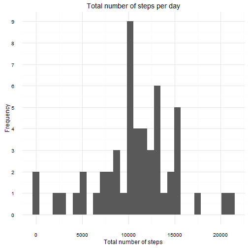
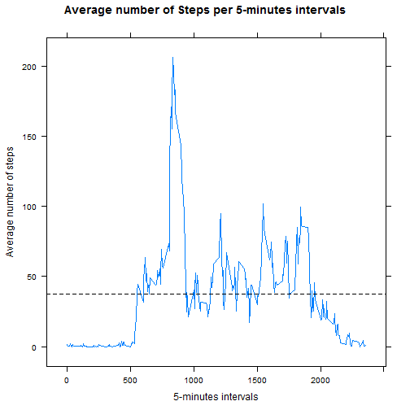
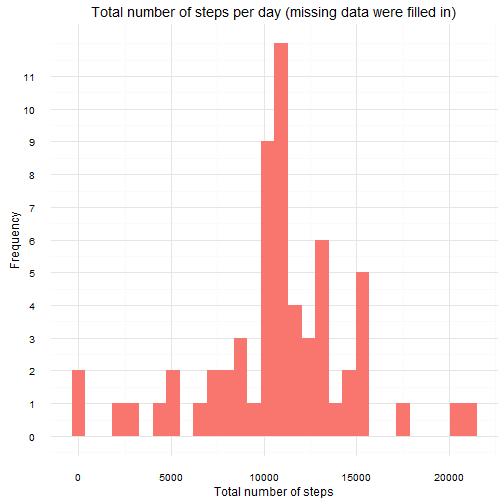
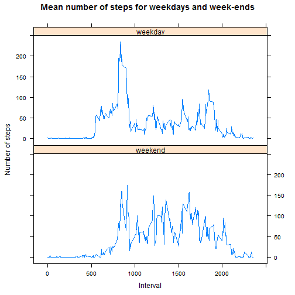

rm---
title: "Reproducible Research: Peer Assessment 1"
output: 
  html_document:
    keep_md: true
---
# Load libraries


## Load the data
Unzip and load the data into a R object.

```r
    unzip(zipfile = "activity.zip")
    activity <- read.csv("activity.csv", header = TRUE)
    str(activity)
```

```
## 'data.frame':	17568 obs. of  3 variables:
##  $ steps   : int  NA NA NA NA NA NA NA NA NA NA ...
##  $ date    : Factor w/ 61 levels "2012-10-01","2012-10-02",..: 1 1 1 1 1 1 1 1 1 1 ...
##  $ interval: int  0 5 10 15 20 25 30 35 40 45 ...
```


## What is mean total number of steps taken per day?

We can compute the total number of steps taken per day with tapply().

```r
    StepsPerDay <- tapply(activity$steps, activity$date, sum)
```

We are asked to create an histogram of the total number of steps taken each day.

```r
    qplot(StepsPerDay) + theme_minimal() + theme(legend.position="none") + 
        scale_y_continuous(breaks = seq(0, 11, by = 1)) + 
        labs(x = "Total number of steps") + labs(y = "Frequency") + 
        labs(title = "Total number of steps per day")
```

```
## `stat_bin()` using `bins = 30`. Pick better value with `binwidth`.
```

```
## Warning: Removed 8 rows containing non-finite values (stat_bin).
```



The mean and median number of steps per day can be computed as follow.

```r
    mn <- mean(StepsPerDay, na.rm = TRUE)
    med <- median(StepsPerDay, na.rm = TRUE)
    c(mean = mn, median = med)
```

```
##     mean   median 
## 10766.19 10765.00
```


## What is the average daily activity pattern?

We can take the mean of each intervals, averaged over all days.

```r
    meanStepsPerInterval <- tapply(activity$steps, activity$interval, mean, na.rm = TRUE)
```

We can now plot the average daily activity pattern.

```r
    # Create a data frame for easier plotting
    meanStepsdf <- data.frame(interval = unique(activity$interval), meanSteps = unname(meanStepsPerInterval) )
    
    xyplot(meanSteps ~ interval, data = meanStepsdf, type = "l", 
        xlab = "5-minutes intervals", ylab = "Average number of steps", 
	    main = "Average number of Steps per 5-minutes intervals",
        panel = function(x,y,...) {
		    panel.xyplot(x, y, ...)
		    panel.abline(h = mean(meanStepsdf$meanSteps), lty = 2)
	    }
    )
```



From the plot, we can see that the interval with the maximum number of steps is aroun 850. 
The exact value can be computed as follows:

```r
    maxIdx <- which(meanStepsdf$meanSteps == max(meanStepsdf$meanSteps))
    meanStepsdf$interval[maxIdx]
```

```
## [1] 835
```
Thus the interval 835 is the 5-minute interval with the maximum number of steps.


## Imputing missing values

The total number of missing values in the dataset is

```r
    sum(!complete.cases(activity$steps))
```

```
## [1] 2304
```

We want to replace all NA values by the mean number of steps of its 5-minutes identifier.

```r
    activity_noNa <- activity
    for (idx in seq(dim(activity)[1])) {
        if (is.na(activity_noNa$steps[idx])) {
            intervalIdentifier <- activity_noNa$interval[idx]
            activity_noNa$steps[idx] <- meanStepsdf$meanSteps[meanStepsdf$interval == intervalIdentifier]
        }
    }
    
    # The total number of missing values of this new dataset should be zero.    
    sum(!complete.cases(activity_noNa$steps))
```

```
## [1] 0
```
We don't have any missing values anymore.

Let's reproduce the code from earlier.
We can compute the total number of steps taken per day with tapply and plot the histogram

```r
    StepsPerDay_noNa <- tapply(activity_noNa$steps, activity_noNa$date, sum)
    
    qplot(StepsPerDay_noNa, fill = "pink") + theme_minimal() + theme(legend.position="none") + 
        scale_y_continuous(breaks = seq(0, 11, by = 1)) + 
        labs(x = "Total number of steps") + labs(y = "Frequency") + 
        labs(title = "Total number of steps per day (missing data were filled in)")
```

```
## `stat_bin()` using `bins = 30`. Pick better value with `binwidth`.
```



The mean and median number becomes

```r
    mn_noNa <- mean(StepsPerDay_noNa)
    med_noNa <- median(StepsPerDay_noNa)
    c(mean = mn_noNa, median = med_noNa)
```

```
##     mean   median 
## 10766.19 10766.19
```
The mean value has not changed but the median has increased. Now, the median and the mean are equal.


## Are there differences in activity patterns between weekdays and weekends?

First, add a fourth column which is the date as Date (i.e. POSIXct) rather than factor.

```r
    activity$datePOSIXct <- strptime(activity$date, "%Y-%m-%d")
```

Add a factor column indicating if it is "weekday" or "weekend".

```r
    week <- weekdays(activity$datePOSIXct) %in% c("Saturday", "Sunday")
    activity$day <- ifelse(week, "weekend", "weekday")
```

We can now compute the mean number of steps for weekday and weekend

```r
    sp <- split(activity$steps, list(activity$day, activity$interval))
    DayIntervalMeanStep <- sapply(sp, mean, na.rm = TRUE)
```

Our new object DayIntervalMeanStep needs to be reshaped into a data frame.

```r
    day <- rep(c("weekday", "weekend"), each = length(DayIntervalMeanStep)/2)    
    intervalIDPerDay <- rep(unique(activity$interval), times = 2)
    weekdayIDX <- seq(1, length(DayIntervalMeanStep), by = 2)
    weekendIDX <- seq(2, length(DayIntervalMeanStep), by = 2)
    meanStepsPerIntervalPerDay <- c(DayIntervalMeanStep[weekdayIDX], DayIntervalMeanStep[weekendIDX])
    
    # Here is the data frame that will be used for plotting
    meanStepsPerDayDF <- data.frame(day = day, interval = intervalIDPerDay, meanSteps = meanStepsPerIntervalPerDay )
    head(meanStepsPerDayDF)
```

```
##                day interval meanSteps
## weekday.0  weekday        0 2.3333333
## weekday.5  weekday        5 0.4615385
## weekday.10 weekday       10 0.1794872
## weekday.15 weekday       15 0.2051282
## weekday.20 weekday       20 0.1025641
## weekday.25 weekday       25 1.5128205
```

Finally, plot the number of steps for weekday and weekend.

```r
    xyplot(meanSteps ~ interval | day, data = meanStepsPerDayDF, 
       type = "l", xlab = "Interval", ylab = "Number of steps",
       main = "Mean number of steps for weekdays and week-ends",
       layout = c(1,2), as.table = TRUE)
```



Finished!

